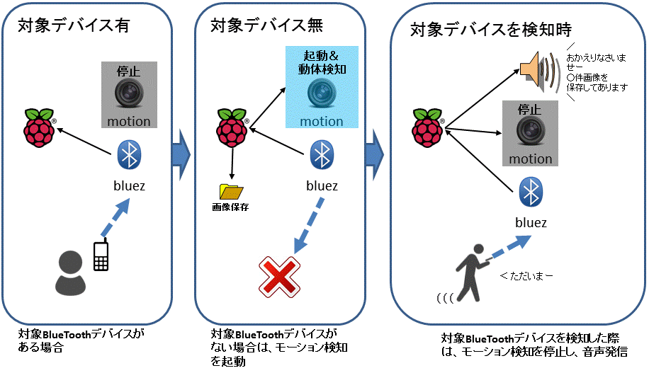

PiTime
====

RaspberryPi3で防犯カメラ

## システム概要

## 他に必要なもの

・motion構築  
・カメラ認識  
・スピーカーで音声再生  
・AquesTalkPiインストール  

## ライセンス

This software is released under the [MIT Licenses](https://opensource.org/licenses/mit-license.php)

## 免責事項

本ソフトウェアは使用者の責任において利用してください。  
このプログラムによって発生したいかなる障害・損害も、作成者は一切責任を負わないものとします。  
また、本プログラムは予告なく削除または変更する場合があります。  
